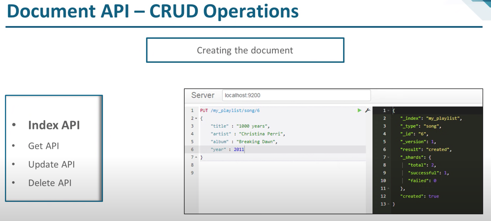
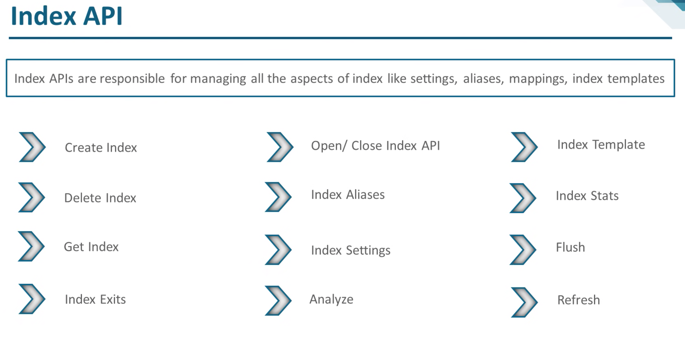
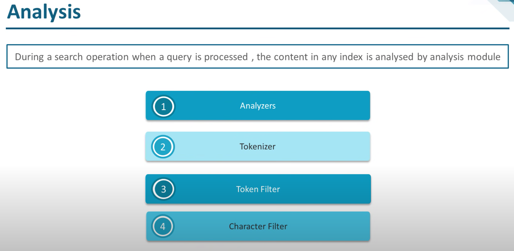

# Introduction

Elasticsearch(ES) experimentation, ideas and quick wins to go through setting up ES with optimisations or quick ways to learn how to use it.











## Environment and playing with ES

Locally there is a _Makefile_ to help start and stop the Elasticsearch (ES) docker service. This assumes docker is setup on your machine. The version of ES utilised is **7.15**, and for more information on whats new checkout [release highlights](https://www.elastic.co/guide/en/elasticsearch/reference/current/release-highlights.html).

1. **Start** **multi node** Elastic on port 9200

   ```makefile
   make es-multi-up
   ```

2. **Down multi node** Elastic search

   ```makefile
   make es-multi-down
   ```

3. **Start a single node** using docker

   ```makefile
   make es-single-up
   ```

4. **Clean docker**

   ```makefile
   make clean-es
   ```

5. **Test ES** is up and running

   ```makefile
   make es-test
   ```

   This should output elastic data about node information

   ```bash
   Checking nodes...
   curl "http://localhost:9200/_cat/nodes?v=true"
   ip         heap.percent ram.percent cpu load_1m load_5m load_15m node.role   master name
   172.20.0.2           37          73   1    0.01    0.13     0.28 cdfhilmrstw *      es02
   172.20.0.4           71          73   0    0.01    0.13     0.28 cdfhilmrstw -      es03
   172.20.0.3           47          73   0    0.01    0.13     0.28 cdfhilmrstw -      es01
   ```

6. **Health check** on cluster

   ```makefile
   make es-health
   ```

   This should output elastic data about node information

   ```bash
   Checking health and cluster stats...
   curl "http://localhost:9200/_cluster/health?pretty"
   {
     "cluster_name" : "docker-cluster",
     "status" : "yellow",
     "timed_out" : false,
     "number_of_nodes" : 1,
     "number_of_data_nodes" : 1,
     "active_primary_shards" : 16,
     "active_shards" : 16,
     "relocating_shards" : 0,
     "initializing_shards" : 0,
     "unassigned_shards" : 15,
     "delayed_unassigned_shards" : 0,
     "number_of_pending_tasks" : 0,
     "number_of_in_flight_fetch" : 0,
     "task_max_waiting_in_queue_millis" : 0,
     "active_shards_percent_as_number" : 51.61290322580645
   }
   ```

## Detailed Tutorial Links

Attached are some PDF's shared to read before even going through the main documentation. This includes [Introducing Elasticsearch](./introducing-elasticsearch-slides.pdf) ,[executing crud operations](./executing-crud-operations-using-the-elasticsearch-apis-slides.pdf) and [executing search requests using es query dsl](./executing-search-requests-using-elasticsearch-query-dsl-slides.pdf).

Add a **chrome plugin** to help you do ElastiSearch stuff called [ElasticSearch Head](https://chrome.google.com/webstore/detail/elasticsearch-head/ffmkiejjmecolpfloofpjologoblkegm) to help visualise your Elasticsearch instance, to see indexes, create structured queries and lots more


1. [Getting started](https://www.elastic.co/guide/en/elasticsearch/reference/current/getting-started.html) had some realy good examples to run with curl and I found to be an easy exercise to jump into the details
2. [Configuring](https://www.elastic.co/guide/en/elasticsearch/reference/current/important-settings.html) important settings through CURL and [system configuration](https://www.elastic.co/guide/en/elasticsearch/reference/current/system-config.html)
   - [Secure settings](https://www.elastic.co/guide/en/elasticsearch/reference/current/secure-settings.html)
   - [Audit settings](https://www.elastic.co/guide/en/elasticsearch/reference/current/auditing-settings.html)
   - [Circuit breaker](https://www.elastic.co/guide/en/elasticsearch/reference/current/circuit-breaker.html) settings to prevent out of memory issues
   - [Shard or Cluster-level](https://www.elastic.co/guide/en/elasticsearch/reference/current/modules-cluster.html) allocation settings
   - [Logging settings](https://www.elastic.co/guide/en/elasticsearch/reference/current/logging.html)
   - [Nodes by role settings](https://www.elastic.co/guide/en/elasticsearch/reference/current/modules-node.html)
   - [Network settings](https://www.elastic.co/guide/en/elasticsearch/reference/current/modules-network.html)
   - [Search settings](https://www.elastic.co/guide/en/elasticsearch/reference/current/search-settings.html)
   - [Security settings](https://www.elastic.co/guide/en/elasticsearch/reference/current/security-settings.html)
3. ES needs to be [upgraded](https://www.elastic.co/guide/en/elasticsearch/reference/current/setup-upgrade.html) from time to time and there are rolling, Full cluster or reindex options available
4. [Elastic guide](https://www.elastic.co/guide/en/elasticsearch/reference/current/index.html) for 7.15 for everything
5. [Query DSL](https://www.elastic.co/guide/en/elasticsearch/reference/current/query-dsl.html) or Abstract Tree of Queries
6. [Search Aggregations](https://www.elastic.co/guide/en/elasticsearch/reference/current/search-aggregations.html) summarizes your data as metrics, statistics, or other analytics
7. [SQL X-Pack](https://www.elastic.co/guide/en/elasticsearch/reference/current/xpack-sql.html) includes a SQL feature to execute SQL queries against Elasticsearch indices and return results in tabular format (Need to understand more)

## Documentation and references

### Docker setup

Really good clear link for setting up docker @ https://www.elastic.co/guide/en/elasticsearch/reference/current/docker.html. There is fantastic instructions for configuring development images, and most importantly **production** configuration including increasing nodes, memory and many other things to make this more resillient.

More advanced topics about **configuring docker** to secure, encrypt and other can be found @ https://www.elastic.co/guide/en/elasticsearch/reference/current/settings.html

### References and videos

- [ ] https://www.youtube.com/watch?v=C3tlMqaNSaI tutorial for beginners and has a linked extensive Udemy course
- [ ] https://www.youtube.com/watch?v=SOTFnRezIH0 is a deep dive into AWS ES
- [ ] https://www.youtube.com/watch?v=c9O5_a50aOQ ES does and don'ts
- [ ] https://www.youtube.com/watch?v=1EnvkPf7t6Y is a quick overview of all ES concepts summarised above for quick impact as images
- [ ] https://www.youtube.com/watch?v=CeGtqouT8eA TODO
- [ ] https://www.youtube.com/watch?v=PpX7J-G2PEo TODO
- [ ] https://www.youtube.com/watch?v=gQ1c1uILyKI TODO
- [ ] https://www.youtube.com/watch?v=PpX7J-G2PEo TODO
- [ ] https://www.youtube.com/watch?v=Yc-G13lEbpc TODO
- [ ] https://www.youtube.com/watch?v=DRQJHOOstY0 TODO
- [ ] ...
